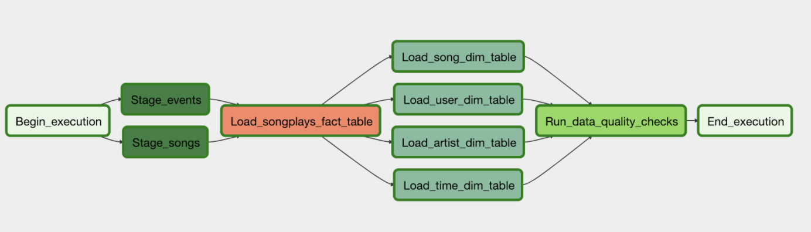

# Data Pipelines with Airflow

Sparkify is a music streaming app. The analytics team has decided that it is time to introduce more automation and monitoring to their data warehouse ETL pipelines and come to the conclusion that the best tool to achieve this is Apache Airflow.

**Goal** 

Build high grade data pipelines that are dynamic and built from reusable tasks, can be monitored, and allow easy backfills. The data quality plays a big part when analyses are executed on top the data warehouse and data quality checks have been created to run tests against the datasets after the ETL steps have been executed to catch any discrepancies in the datasets.

The source data resides in S3 and needs to be processed in Sparkify's data warehouse in Amazon Redshift. The source datasets consist of JSON logs that tell about user activity in the application and JSON metadata about the songs the users listen to.

## Database

Two datasets are used to build the tables :
### **Song Dataset**
Songs dataset is a subset of [Million Song Dataset](http://millionsongdataset.com/).

Sample Record :
```
{"num_songs": 1, "artist_id": "ARJIE2Y1187B994AB7", "artist_latitude": null, "artist_longitude": null, "artist_location": "", "artist_name": "Line Renaud", "song_id": "SOUPIRU12A6D4FA1E1", "title": "Der Kleine Dompfaff", "duration": 152.92036, "year": 0}
```

### **Log Dataset**
Logs dataset is generated by [Event Simulator](https://github.com/Interana/eventsim).

Sample Record:

```
{"artist": null, "auth": "Logged In", "firstName": "Walter", "gender": "M", "itemInSession": 0, "lastName": "Frye", "length": null, "level": "free", "location": "San Francisco-Oakland-Hayward, CA", "method": "GET","page": "Home", "registration": 1540919166796.0, "sessionId": 38, "song": null, "status": 200, "ts": 1541105830796, "userAgent": "\"Mozilla\/5.0 (Macintosh; Intel Mac OS X 10_9_4) AppleWebKit\/537.36 (KHTML, like Gecko) Chrome\/36.0.1985.143 Safari\/537.36\"", "userId": "39"}
```

## Database schema design and ETL Pipeline

The project is divided into 2 important steps :
- 1. Create tables with a star schema 
- 2. Building ETL Pipeline 

### 1. Create tables with a Star Schema 


The project is composed of one fact table and four dimension tables. The fact table, named _songplays_, records in log data associated with song plays. This table provides the metrics of the data I want to extract. The dimension tables provide information related to different dimensions of the fact table, such as _users_, _songs_, _artists_ and _time_ which records respectively the users, the songs, the artists and the timestamp of records in _songplays_ broken down into different units. The final tables are created by SQL queries in ```sql_queries.py```.

#### Fact Table

songplays - records in event data associated with song plays.

    songplay_id, start_time, user_id, level, song_id, artist_id, session_id, location, user_agent

#### Dimension Tables 

##### users

    user_id, first_name, last_name, gender, level

##### songs

    song_id, title, artist_id, year, duration

##### artists

    artist_id, name, location, lattitude, longitude

##### time

    start_time, hour, day, week, month, year, weekday

### 2. Building ETL Pipelines

Airflow is a platform to programmatically author, schedule and monitor workflows.It is often useful to visualize complex data flows using a graph. Visually, a node in a graph represents a task, and an arrow represents the dependency of one task on another. Given that data only needs to be computed once on a given task and the computation then carries forward, the graph is directed and acyclic. This is why Airflow jobs are commonly referred to as “DAGs” (Directed Acyclic Graphs).



#### Operators

DAGS shows how the pipelines are built, and how task is dependent to another. Tasks are described as operators, it shows what to do in a data pipeline.

* StageToRedshift Operator: The stage operator is expected to be able to load any JSON formatted files from S3 to Amazon Redshift. The operator creates and runs a SQL COPY statement based on the parameters provided. The operator's parameters specify where in S3 the file is loaded and what is the target table.

* LoadFact and LoadDimension Operator: With dimension and fact operators, tables are created by running data transformations with ```sql_queries.py```. Most of the logic is within the SQL transformations and the operator takes as input a SQL statement and target database on which to run the query against.

* Data Quality Operator: This final operator is used to run checks on the data itself. The operator's main functionality is to receive one or more SQL based test cases along with the expected results and execute the tests. For each the test, the test result and expected result needs to be checked and if there is no match, the operator should raise an exception and the task should retry and fail eventually.

## Environment 
* Python 3.6 or above
* Apache Airflow 
* AWS Redshift 

## How to Run
1. Launch a Redshift Cluster 
2. Add your AWS credentials with Airflow's UI
On the create connection page, enter the following:
	* **Conn Id**: Enter ```aws_credentials```.
	* **Conn Type**: Enter ```Amazon Web Services```.
	* **Login**: Enter your Access key ID from the IAM User credentials you downloaded earlier.
	* **Password** : Enter your Secret access key from the IAM User credentials you downloaded earlier.

3. Add Redshift connection settings with Airflow's UI
On the create connection page, enter the following:
	* **Conn Id**: Enter ```redshift```.
	* **Conn Type**: Enter ```Postgres```.
	* **Host**: Enter the endpoint of your Redshift cluster, excluding the port at the end. You can find this by selecting your cluster in the Clusters page of the Amazon Redshift console. See where this is located in the screenshot below. IMPORTANT: Make sure to NOT include the port at the end of the Redshift endpoint string.
	* **Schema**: Enter dev. This is the Redshift database you want to connect to.
	* **Login**: Enter ```awsuser```.
	* **Password**: Enter the password you created when launching your Redshift cluster.
	* **Port**: Enter ```8080```.

4. Start Airflow web server
```
$ airflow webserver --port 8080
```

## References 

* [AWS Redshift Documentation](https://aws.amazon.com/redshift/getting-started/?p=rs&bttn=hero&exp=b)
* [Airflow Documentation](https://airflow.apache.org/docs/)


